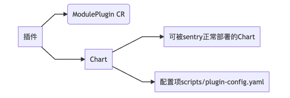
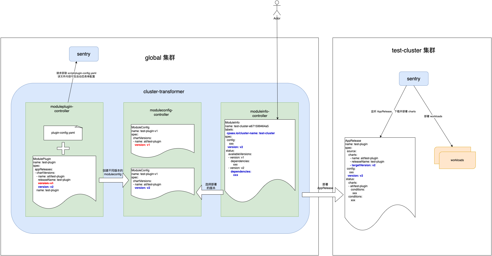

# Plugin Packager
## 插件的组成结构
插件由插件声明（ModulePlugin CR）和插件 chart 包组成。 插件声明中包含插件的基础信息和部署条件，
插件 chart 包为一个正常可由 sentry 部署的 chart 和动态表单配置文件。

### 插件的声明（ModulePlugin CR）
ModulePlugin 需要安装之后才能在插件列表页显示出插件。ModulePlugin 配置说明参考文档 [moduleplugin.md](docs%2Fmoduleplugin.md)。

ModulePlugin CR 创建后 插件中心会根据 .appReleases.chartVersions 中 chart 版本号创建 ModuleConfig 资源, 每个插件版本都会生成对应的 ModuleConfig CR。

### 插件的配置项（scripts/plugin-config.yaml）
scripts/plugin-config.yaml 文件需要创建在 ModulePlugin CR 指定的 mainChart 中. <strong>没有配置项的插件也需要这个文件</strong>。插件配置示例参考文档 [scriptpluginconfig.md](docs/scriptspluginconfig.md)。

### 动态表单
动态表单，即前端预设一套内置的表单控件，并提供配置能力，让后端/用户能够通过配置直接生成表单。
使用动态表单的目的是，后端组件部署升级时的表单配置，可以由各组件后端维护，与前端业务代码解耦。

动态表单的配置方式参考文档 [scriptspluginconfig.md](docs/scriptspluginconfig.md)。

## 插件工作原理


插件的安装和管理是由 global 集群的 cluster-transformer 组件（插件中心）实现的。cluster-transformer 提供了很多 controller，与插件相关的 controller 主要有三个：

- moduleplugin-controller：协调 ModulePlugin CR，该资源定义了插件所需的 AppRelease、Logo、显示名称、展示或升级时的中英文文案等信息，资源状态会更新插件部署的集群以及插件版本信息、关联的 ModuleConfig 信息。该 controller 也会为每个插件版本创建一个 ModuleConfig 资源，如果插件提供了动态表单，也会把表单配置信息渲染到 ModuleConfig 资源中。
- moduleconfig-controller：协调 ModuleConfig CR，该资源定义了插件某个版本的配置信息，具体包括：亲和反亲和配置、AppRelease 列表、动态表单配置、依赖的 Module、主 Chart 等；
- moduleinfo-controller：协调 ModuleInfo 资源，该资源定义了插件部署的目标集群、插件版本、插件 Entrypoint 等。controller 会根据插件版本选择对应的 ModuleConfig 在目标集群安装 AppRelease。

结合上图，插件的工作流程如下：
1. 先把 ModulePlugin 部署到集群，moduleplugin-controller 会结合 ModulePlugin、ProductBase、从 sentry 请求插件配置文件（文件中包含了动态表单配置）scripts/plugin-config.yaml 生成或更新 ModuleConfig 资源；
   1. 如果 ModulePlugin 的 spec.appReleases[].version 值是 refer-to-productbase，表示 chart 的版本参考 ProductBase，否则以 ModulePlugin 的值为准；
   2. ModulePlugin 会向 sentry 加载指定版本的 chart 中 scripts/plugin-config.yaml 内容，该配置里包含了插件的详细配置，比如 supportedUpgradeVersions 定义了可支持升级的版本，deployDescriptors 定义了动态表单配置。
2. moduleplugin-controller 根据 AppRelease 中所有 chart 的版本计算出新的版本号作为 ModuleConfig 的版本，并创建 ModuleConfig。这也意味着只要 AppRelease 的 chart 中任何一个版本发生了变化，moduleplugin-controller 就会创建出一个新的 ModuleConfig 资源。
3. 前端创建 ModuleInfo 资源，该资源指定了插件版本、插件需要部署的集群以及插件的依赖。moduleinfo-controller 等待插件的依赖运行正常之后才会往目标集群部署插件的 AppRelease 资源。
4. 目标集群的 sentry 服务监听到 AppRelease 的请求，会下载对应的 chart 并协调出 workloads，直到所有的 workloads 运行正常，更新 AppRelease 的状态。

## 插件的生命周期
### 部署插件
1. 用户在页面上点击插件部署；
2. 前端创建 ModuleInfo CR, 如果有用户配置, 用户配置保存在 ModuleInfo spec.config 中； 
3. 插件中心渲染 valuesTemplate, 生成AppRelease； 
4. 插件中心将AppRelease在目标集群创建；
5. 目标集群的sentry处理AppRelease 进行部署；

### 修改插件配置
1. 用户在 ACP 页面上点击插件更新配置参数；
2. 前端更新 ModuleInfo spec.config； 
3. 插件中心渲染valuesTemplate, 更新AppRelease； 
4. 插件中心将 AppRelease 在目标集群更新； 
5. 目标集群的 sentry 处理 AppRelease 进行更新。

### 删除插件
1. 用户在页面上点击插件删除； 
2. 前端删除 ModuleInfo CR； 
3. 插件中心删除目标集群上的 AppRelease。

## 插件配置说明
1. ModulePlugin: [moduleplugin.md](docs/moduleplugin.md)
2. ModuleConfig: [moduleconfig.md](docs/moduleconfig.md)
3. ModuleInfo: [moduleinfo.md](docs/moduleinfo.md)
4. scripts/plugin-config：[scriptspluginconfig.md](docs/scriptspluginconfig.md)

## 如何打包和安装插件
### 打包插件
1. 准备打包制品，包含三部分内容： ModulePlugin.yaml，插件 charts 制品 和制品清单。
   1. ModulePlugin.yaml 示例参考文档 [moduleplugin.yaml](docs/examples/yamls/moduleplugin.yaml)，配置的字段含义参考文档 [moduleplugin.md](docs/moduleplugin.md)； 
   2. 插件至少包含一个 chart，如果包含多个chart，则其中有一个chart需要设置为主chart。chart 需要以 OCI chart 格式存储到镜像仓库中。在主chart中，需要增加一个配置文件，配置文件的路径为 scripts/plugin-config.yaml，配置的字段说明参考文档 [scriptpluginconfig.md](docs/scriptspluginconfig.md)。scripts/plugin-config.yaml 示例参考 
   3. 制品清单是一个文本文件，每行一个OCI制品，包括 chart 和 镜像，空行和以 # 开头的行将忽略，示例如下：
   ```text
   # 示例制品清单
   ait/chart-example:v0.0.1
   ait/example-image:v0.0.1
   ```
2. 打包插件
   1. 将当前仓库克隆到本地，执行打包命令：
   ```shell
   bash package.sh \
     --registry 制品所在的镜像仓库 \
     --username 镜像仓库用户名 \
     --password 镜像仓库密码 \
     --resources MoudulePlugin 的 yaml 文件的路径 \
     --artifacts 制品清单文件路径 \
     --output 打包后的插件包文件的输出路径
   ```
   注意：package.sh 在执行过程中可能会访问 github 下载 skopeo 工具。
### 安装插件
1. 解打包好的插件包 output.tgz 复制到 global 集群的 master 节点，用如下命令解压安装包：
   ```shell
   tar xzvf output.tgz
   # output.tgz 换成真正的插件包的文件名。
   # 安装包的内容将解压的当前目录，可以增加 -C <目标路径> 指定解压目录，例如，下面命令将解压到 mypluin 子目录下：
   mkdir myplugin
   tar xzvf output.tgz -C myplugin
   ```
2. 执行如下安装命令：
   ```shell
   # 进入到插件包的解压目录，执行如下命令
   bash setup.sh
   
   # setup.sh 将从环境中探查镜像仓库的地制和访问凭证，如果平台采用了外包的镜像仓库，可以增加参数指定镜像仓库，例如：
   bash setup.sh --registry 镜像仓库地址 --username 镜像仓库用户名 --password 镜像仓库密码
   
   # 如果想跳过导入制品的步骤，可以执行:
   bash setup.sh --skip-upload=true
   ```
### 部署和卸载插件
- 在平台管理中点击：集群管理→ 集群→ 进入需要安装插件的集群 → 插件→ {插件名称} → 部署 
- 在平台管理中点击：集群管理→ 集群→ 进入需要卸载插件的集群 → 插件→ {插件名称} → 卸载