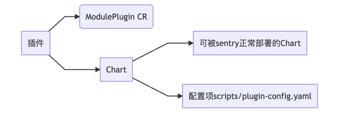

# Plugin Packager
## 插件的组成结构
插件由插件声明（ModulePlugin CR）和插件 chart 包组成。 插件声明中包含插件的基础信息和部署条件，
插件 chart 包为一个正常可由 sentry 部署的 chart 和动态表单配置文件。

### 插件的声明（必选。ModulePlugin CR module-plugin.yaml）
ModulePlugin CR 声明了插件的名称，集群亲和配置，chart 列表等信息。参考示例 [moduleplugin.md](docs%2Fmoduleplugin.md)。

ModulePlugin CR 中可声明多个 chart，.spec.mainChart 为主 chart。ModulePlugin CR 内容保存在文件 module-plugin.yaml，该文件放在主 chart 根目录。

ModulePlugin CR 的 .spec.version 字段声明了当前插件的版本，平台会根据当前 CR 创建出一个 ModuleConfig CR，表示对应的插件版本。如果升级新版本，只需要变更 ModulePlugin CR 的 .spec.version 字段便会生成新的 ModuleConfig CR。

### 插件的配置项（必选。scripts/plugin-config.yaml）
scripts/plugin-config.yaml 文件需要创建在 ModulePlugin CR 指定的 mainChart 中. <strong>没有配置项的插件也需要这个文件</strong>。插件配置示例参考文档 [scriptpluginconfig.md](docs/scriptspluginconfig.md)。

### 镜像清单（必选）
主 chart values.yaml 中声明插件所需的镜像清单。需要按如下格式声明：
```yaml
global:
  images: # 镜像清单
    kubectl: # 镜像名称，可自定义
      repository: 3rdparty/kubectl # 镜像仓库地址
      tag: v1.31.2 # 镜像 tag
      code: github.com/kubernetes/kubernetes # 代码仓库
      support_arm: true # 是否支持 arm 架构
      thirdparty: true  # 是否是三方镜像
```

### 动态表单（可选）
动态表单，即前端预设一套内置的表单控件，并提供配置能力，让后端/用户能够通过配置直接生成表单。
使用动态表单的目的是，后端组件部署升级时的表单配置，可以由各组件后端维护，与前端业务代码解耦。

动态表单的配置方式参考文档 [scriptspluginconfig.md](docs/scriptspluginconfig.md)。

## 插件的生命周期
### 部署插件
1. 用户在页面上点击插件部署；
2. 前端创建 ModuleInfo CR, 如果有用户配置, 用户配置保存在 ModuleInfo spec.config 中； 
3. 插件中心渲染 valuesTemplate, 生成AppRelease； 
4. 插件中心将AppRelease在目标集群创建；
5. 目标集群的sentry处理AppRelease 进行部署；

### 修改插件配置
1. 用户在 ACP 页面上点击插件更新配置参数；
2. 前端更新 ModuleInfo spec.config； 
3. 插件中心渲染valuesTemplate, 更新AppRelease； 
4. 插件中心将 AppRelease 在目标集群更新； 
5. 目标集群的 sentry 处理 AppRelease 进行更新。

### 删除插件
1. 用户在页面上点击插件删除； 
2. 前端删除 ModuleInfo CR； 
3. 插件中心删除目标集群上的 AppRelease。

## 插件配置说明
1. ModulePlugin: [moduleplugin.md](docs/moduleplugin.md)
2. ModuleConfig: [moduleconfig.md](docs/moduleconfig.md)
3. ModuleInfo: [moduleinfo.md](docs/moduleinfo.md)
4. scripts/plugin-config：[scriptspluginconfig.md](docs/scriptspluginconfig.md)

## 如何打包和安装插件
### 打包插件
1. 下载打包工具 violet。下载地址：
   1. violet_linux_arm64: https://cloud.alauda.io/attachments/knowledge/violet/violet_linux_arm64
   2. violet_linux_amd64: https://cloud.alauda.io/attachments/knowledge/violet/violet_linux_amd64
   3. violet_darwin_arm64: https://cloud.alauda.io/attachments/knowledge/violet/violet_darwin_arm64
   4. violet_darwin_amd64: https://cloud.alauda.io/attachments/knowledge/violet/violet_darwin_amd64
   5. violet_windows_amd64: https://cloud.alauda.io/attachments/knowledge/violet/violet_windows_amd64.exe

2. 准备好 OCI 主 chart 制品，chart 中包含的内容如下：
   1. 插件的声明文件 module-plugin.yaml，必须放在 chart 根目录。示例参考文档 [moduleplugin.yaml](docs/examples/yamls/moduleplugin.yaml)，配置的字段含义参考文档 [moduleplugin.md](docs/moduleplugin.md)； 
   2. 插件配置文件 scripts/plugin-config.yaml。即使不需要动态表单，也必须有该文件。配置的字段说明参考文档 [scriptpluginconfig.md](docs/scriptspluginconfig.md)。scripts/plugin-config.yaml 示例参考；
   3. helm chart 文件。

3. 打包插件
   1. violet create 初始化插件：
   ```shell
   violet_linux_amd64 create \
     <plugin-name> \
     --artifact OCI chart 地址 \
     --platforms 默认值 linux/amd64。期望导出的容器镜像所支持的系统架构，linux/amd64 表示 x86，linux/arm64 表示 ARM \
     --plain 可选。主制品所在镜像仓库以 http 访问时，指定此参数，例子中镜像仓库 harbor.demo.io 是需要 https 访问，所以未指定此参数
     --username 镜像仓库用户名 \
     --password 镜像仓库密码 \
     --module-plugin 可选。MoudulePlugin 的 yaml 文件的路径
   ```
   2. violet package 打包插件：
   ```shell
   violet_linux_amd64 package \
     <plugin-name> \
     --plain 可选。主制品所在镜像仓库以 http 访问时，指定此参数，例子中镜像仓库 harbor.demo.io 是需要 https 访问，所以未指定此参数
     --username 镜像仓库用户名 \
     --password 镜像仓库密码
   ```
   该命令会在当前目录生成一个 <plugin-name>.tgz 文件。
   3. violet push 上架插件：
   ```shell
   violet_linux_amd64 push <plugin-name>.tgz \
     --platform-address ACP 平台地址 \
     --platform-username ACP 平台登录用户名 \
     --platform-password ACP 平台登录用户名
   ```

### 部署和卸载插件
- 在平台管理中点击：集群管理→ 集群→ 进入需要安装插件的集群 → 插件→ {插件名称} → 部署 
- 在平台管理中点击：集群管理→ 集群→ 进入需要卸载插件的集群 → 插件→ {插件名称} → 卸载

## 插件开发规范
1. 插件只管理和配置自身的资源。如果有依赖的资源，这些资源由依赖的插件控制； 
2. 插件版本要符合 semver 规范：有重大变更递增主版本号，兼容变更递增次要版本号，bug 修复递增 patch 版本号； 
3. 如果有依赖的插件，需要在 ModulePlugin 资源 spec.dependencies[] 字段配置依赖的插件列表，同时在 spec.dependencies[].versionsMatch[] 字段中配置依赖的插件版本列表; 
   1. 配置依赖的示例：
   ```yaml
   apiVersion: cluster.alauda.io/v1alpha1
   kind: ModulePlugin
   metadata:
   name: plugin-demo
   spec:
   # ...
   - dependencies
      - moduleName: kubernetes
        versionsMatch:
         - '>=1.16.0'
   ```
   以上示例中 plugin-demo 插件依赖 kubernetes v1.16.0 以及更高版本。versionMatch 的表达式需要符合 [semver ranges 规范](https://github.com/blang/semver)。
4. 插件中 k8s client 建议使用 ACP 支持的最高 k8s 版本，如果插件中部署或使用 k8s 内置资源，建议用最新稳定版本。避免 ACP 升级后 API 失效影响插件正常使用； 
5. 插件可以独立于 ACP 发版。在有依赖插件或者 ACP 版本变更时，需要开发者回归验证，避免造成插件不可用； 
6. 插件的版本尽量保持向后兼容。尤其插件被其他插件依赖时，兼容的版本可以减少对其他插件的影响。

# 插件样例
完整的插件样例，参考 [sample/chart](sample/chart)
