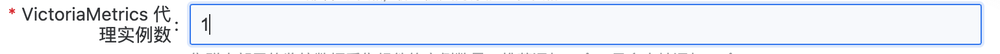
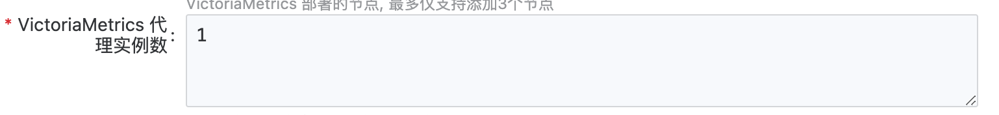
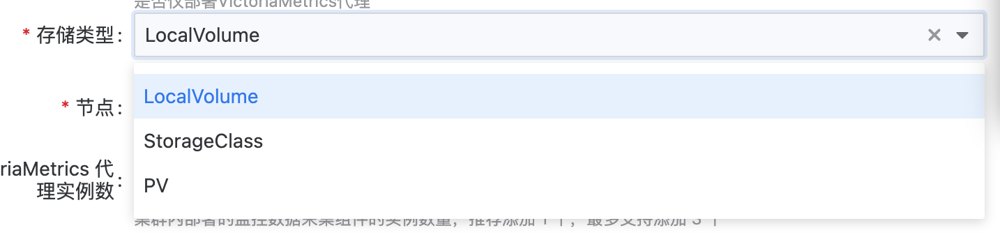
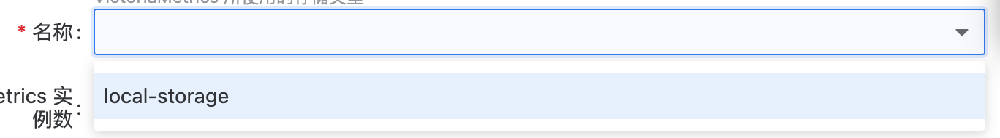
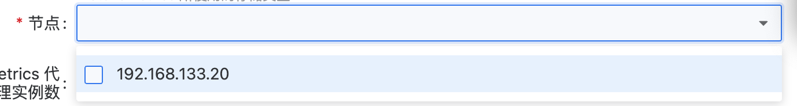
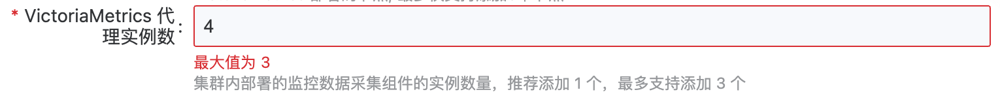
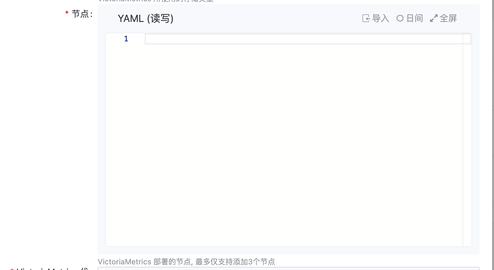
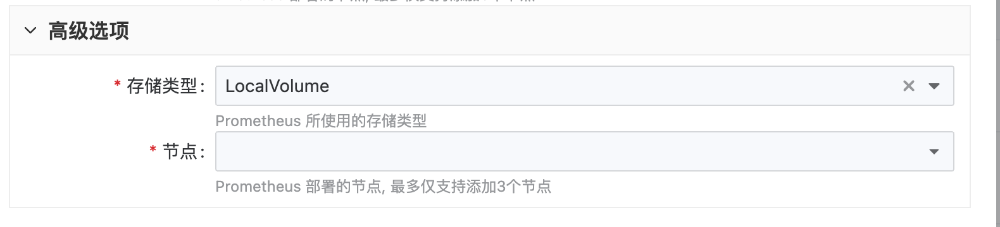
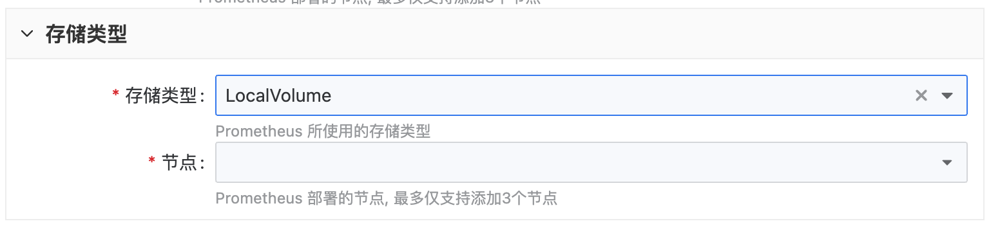

# scripts/plugin-config.yaml 配置说明

# 配置说明
```yaml
# 插件可以支持从哪个旧版本升级
supportedUpgradeVersions: ">= v1.0.0"
# 当升级条件不满足时，如果 mustUpgrade 为 true，则阻塞业务集群统一升级
mustUpgrade: false
# 可选。动态表单的默认值, 当有插件可配置项时必填, 且需要和 deployDescriptors 中的默认值一致
config:
  dataSource:
    audit: true
    event: true
    kubernetes: true
    platform: false
    system: true
    workload: true
# 可选。 chart 值模版, 在插件部署和更新时, 由插件中心渲染并后同 chart 一起部署
valuesTemplates:
  ait/chart-alauda-log-agent: |
    global:
      isOCP: << if eq .ClusterType "OCP" >>true<< else >>false<< end >>
    nevermore:
      apiGatewayUrlPrefix: /v4/callback
      region: << .ClusterName | quote >>
      isOCP: << if eq .ClusterType "OCP" >>true<< else >>false<< end >>
      containerEngine: << if eq .ClusterType "OCP" >>crio<< else >>docker<< end >>
      << if .MiConfig.dataSource >>
      dataSource:
        audit: << .MiConfig.dataSource.audit >>
        event: << .MiConfig.dataSource.event >>
        log:
          host: << .MiConfig.dataSource.system >>
          kubernetes: << .MiConfig.dataSource.kubernetes >>
          platform: << .MiConfig.dataSource.platform >>
          workload: << .MiConfig.dataSource.workload >>
      << end >>
# 可选。部署时的动态表单，path 对应 config 中的路径
deployDescriptors:
- path: dataSource.audit
  x-descriptors:
  - 'urn:alm:descriptor:com.tectonic.ui:booleanSwitch'
  - 'urn:alm:descriptor:com.tectonic.default:true'
  - 'urn:alm:descriptor:label:en:Audit'
  - 'urn:alm:descriptor:label:zh:审计'
  - 'urn:alm:descriptor:description:en:Collect Audit Logs'
  - 'urn:alm:descriptor:description:zh:审计记录是否采集'
- path: dataSource.event
  x-descriptors:
  - 'urn:alm:descriptor:com.tectonic.ui:booleanSwitch'
  - 'urn:alm:descriptor:com.tectonic.default:true'
  - 'urn:alm:descriptor:label:en:Event'
  - 'urn:alm:descriptor:label:zh:事件'
  - 'urn:alm:descriptor:description:en:Collect Event Logs'
  - 'urn:alm:descriptor:description:zh:事件记录是否采集'
- path: dataSource.kubernetes
  x-descriptors:
  - 'urn:alm:descriptor:com.tectonic.ui:booleanSwitch'
  - 'urn:alm:descriptor:com.tectonic.default:true'
  - 'urn:alm:descriptor:label:en:Kubernetes'
  - 'urn:alm:descriptor:label:zh:Kubernetes 日志'
  - 'urn:alm:descriptor:description:en:Collect Kubernetes Logs'
  - 'urn:alm:descriptor:description:zh:Kubernetes 日志是否采集'
- path: dataSource.platform
  x-descriptors:
  - 'urn:alm:descriptor:com.tectonic.ui:booleanSwitch'
  - 'urn:alm:descriptor:com.tectonic.default:false'
  - 'urn:alm:descriptor:label:en:Platform'
  - 'urn:alm:descriptor:label:zh:产品日志'
  - 'urn:alm:descriptor:description:en:Collect Platform Logs'
  - 'urn:alm:descriptor:description:zh:产品日志是否采集'
- path: dataSource.system
  x-descriptors:
  - 'urn:alm:descriptor:com.tectonic.ui:booleanSwitch'
  - 'urn:alm:descriptor:com.tectonic.default:true'
  - 'urn:alm:descriptor:label:en:System'
  - 'urn:alm:descriptor:label:zh:系统日志'
  - 'urn:alm:descriptor:description:en:Collect System Logs'
  - 'urn:alm:descriptor:description:zh:操作系统日志是否采集'
- path: dataSource.workload
  x-descriptors:
  - 'urn:alm:descriptor:com.tectonic.ui:booleanSwitch'
  - 'urn:alm:descriptor:com.tectonic.default:true'
  - 'urn:alm:descriptor:label:en:Workload'
  - 'urn:alm:descriptor:label:zh:应用日志'
  - 'urn:alm:descriptor:description:en:Collect Workload Logs'
  - 'urn:alm:descriptor:description:zh:应用日志是否采集'

# editDescriptors 可选 如果插件在部署后支持配置修改 可定义editDescriptors
editDescriptors:
- path: dataSource.audit
  x-descriptors:
  - 'urn:alm:descriptor:com.tectonic.ui:booleanSwitch'
  - 'urn:alm:descriptor:label:en:Audit'
  - 'urn:alm:descriptor:label:zh:审计'
  - 'urn:alm:descriptor:description:en:Collect Audit Logs'
  - 'urn:alm:descriptor:description:zh:审计记录是否采集'
- path: dataSource.event
  x-descriptors:
  - 'urn:alm:descriptor:com.tectonic.ui:booleanSwitch'
  - 'urn:alm:descriptor:label:en:Event'
  - 'urn:alm:descriptor:label:zh:事件'
  - 'urn:alm:descriptor:description:en:Collect Event Logs'
  - 'urn:alm:descriptor:description:zh:事件记录是否采集'
- path: dataSource.kubernetes
  x-descriptors:
  - 'urn:alm:descriptor:com.tectonic.ui:booleanSwitch'
  - 'urn:alm:descriptor:label:en:Kubernetes'
  - 'urn:alm:descriptor:label:zh:Kubernetes 日志'
  - 'urn:alm:descriptor:description:en:Collect Kubernetes Logs'
  - 'urn:alm:descriptor:description:zh:Kubernetes 日志是否采集'
- path: dataSource.platform
  x-descriptors:
  - 'urn:alm:descriptor:com.tectonic.ui:booleanSwitch'
  - 'urn:alm:descriptor:label:en:Platform'
  - 'urn:alm:descriptor:label:zh:产品日志'
  - 'urn:alm:descriptor:description:en:Collect Platform Logs'
  - 'urn:alm:descriptor:description:zh:产品日志是否采集'
- path: dataSource.system
  x-descriptors:
  - 'urn:alm:descriptor:com.tectonic.ui:booleanSwitch'
  - 'urn:alm:descriptor:label:en:System'
  - 'urn:alm:descriptor:label:zh:系统日志'
  - 'urn:alm:descriptor:description:en:Collect System Logs'
  - 'urn:alm:descriptor:description:zh:操作系统日志是否采集'
- path: dataSource.workload
  x-descriptors:
  - 'urn:alm:descriptor:com.tectonic.ui:booleanSwitch'
  - 'urn:alm:descriptor:label:en:Workload'
  - 'urn:alm:descriptor:label:zh:应用日志'
  - 'urn:alm:descriptor:description:en:Collect Workload Logs'
  - 'urn:alm:descriptor:description:zh:应用日志是否采集'
```

---------------
| 字段                       | 说明                                                    | 必选 |
|--------------------------|-------------------------------------------------------|----|
| supportedUpgradeVersions | 插件可以支持从哪个旧版本升级                                        | 是  |
| mustUpgrade              | 当升级条件不满足时，如果 mustUpgrade 为 true，则阻塞业务集群统一升级           | 是  |
| config                   | 动态表单的默认值, 当有插件可配置项时必填, 且需要和 deployDescriptors 中的默认值一致 | 否  |
| valuesTemplates          | chart 值模版, 在插件部署和更新时, 由插件中心渲染并后同 chart 一起部署           | 否  |
| deployDescriptors        | 部署时的动态表单，path 对应 config 中的路径                          | 否  |
| editDescriptors          | 如果插件在部署后支持配置修改                                        | 否  |

## valuesTemplates
valuesTemplates 中预置了很多值，常用的字段如下：
```
ClusterName     string # 集群名
LabelBaseDomain string # 基础域名的 label
SystemNamespace string # 系统命名空间名字
EnableGPU       bool   # 是否支持 GPU
Replicas        int    # 插件实例副本数。集群只有一个 node 时为 1, 大于 1 时为 2
VIP             string # 集群虚拟 IP 地址
ClusterType     string # 集群类型
NetworkType     string # 网络类型
MasterNodes     []string # 控制面节点列表
Alb2Nodes       []string # ALB2 服务运行的节点列表
Alb2Port        int # ALB2 服务端口
Alb2IP          string # ALB2 IP 地址
Ports           map[string]string # 
RegistryAddress string # 镜像仓库地址
IsGlobal        bool # 当前集群是否时 global 集群
Version         string # 集群版本
MiSpec           minfov1alpha1.ModuleInfoSpec # 对应 ModuleInfo spec
MiConfig         interface{} # 对应插件的用户配置 ModuleInfo spec.config
```

## 动态表单 descriptor 支持的能力
动态表单，即前端预设一套内置的表单控件，并提供配置能力，让后端/用户能够通过配置直接生成表单。
使用动态表单的目的是，后端组件部署升级时的表单配置，可以由各组件后端维护，与前端业务代码解耦。

deployDescriptors 和 editDescriptors 中可以定义插件的动态表单。descriptor 支持的能例如下：

---------------
| descriptor | 能力说明 | 示例  |
| --- | --- | --- |
| urn:alm:descriptor:com.tectonic.ui:booleanSwitch | 基本开关 |     |
| urn:alm:descriptor:com.tectonic.ui:text | 基本输入框 |     |
| urn:alm:descriptor:com.tectonic.ui:textarea | 基本文本框（支持多行） |     |
| urn:alm:descriptor:com.tectonic.ui:number | 基本数字输入 |     |
| urn:alm:descriptor:com.tectonic.ui:fieldGroup: | 用于描述一组数据，主要是ui上将一组数据分组，支持展开收起 | urn:alm:descriptor:com.tectonic.ui:fieldGroup:persistence |
| urn:alm:descriptor:com.tectonic.ui:arrayFieldGroup: | 描述一组数据以array形式位于某个字段下 | urn:alm:descriptor:com.tectonic.ui:arrayFieldGroup:backup.tasks |
| urn:alm:descriptor:com.tectonic.ui:select: | 基本选择框，直接在一个descriptor中传入多个select构成一个下拉选择器 | \- urn:alm:descriptor:com.tectonic.ui:select:a<br><br>\- urn:alm:descriptor:com.tectonic.ui:select:b<br><br>\- urn:alm:descriptor:com.tectonic.ui:select:c |
| urn:alm:descriptor:com.tectonic.ui:advanced | 在每个field内加入此描述，来使得多个项目放置于展开收起之下 |     |
| urn:alm:descriptor:com.tectonic.ui:fieldDependency: | 声明某个field依赖于其他field,即只当指定path的数据为value时展示，格式为 <prefx>path:value | urn:alm:descriptor:com.tectonic.ui:fieldDependency:grafana.enabled:true |
| urn:alm:descriptor:com.tectonic.default: | 声明某个field的默认值 | urn:alm:descriptor:com.tectonic.default:1 |
| urn:alm:descriptor:com.tectonic.ui:hidden | 指定该field隐藏 |     |
| urn:alm:descriptor:label:en: | 指定label英文名称，label即表单控件左边的文本 |     |
| urn:alm:descriptor:label:zh: | 指定label中文名称 |     |
| urn:alm:descriptor:description:en: | 指定表单控件下方描述字段（英文） |     |
| urn:alm:descriptor:description:zh: | 指定表单控件下方描述字段（中文） |     |
| urn:alm:descriptor:com.tectonic.ui:yaml | yaml 编辑框 |     |
| urn:alm:descriptor:com.tectonic.ui:multiple | 支持多个，目前仅在 resourcePrefix中支持多选，未来可扩展 |     |
| urn:alm:descriptor:com.tectonic.ui:validation: | 指定某个field的校验器，格式为 <prefix>:<validator>:<value><br><br>其中validator支持<br><br>maximum：数字的最大<br><br>minimum：数字最小<br><br>maxLength：多选的最大个数，输入框最大字符数<br><br>minLength：多选的最小个数，输入框最小字符数<br><br>pattern：格式校验用正则<br><br>required：是否必填，如果有会给表单控件label加个 \*<br><br>其中需要的参数作为value传入在最后，如果没有参数，比如required<br><br>则为 <prefix>:<validator> | urn:alm:descriptor:com.tectonic.ui:validation:maximum:3<br><br>urn:alm:descriptor:com.tectonic.ui:validation:required |
| urn:alm:descriptor:io.kubernetes: | 用于资源选择，其中格式为<prefix><Resource>?=<metaParam>:<queryParam><br><br>其中metaParam用于描述api解析相关内容，目前仅支持isGlobal来指示是否为global resource，queryParam会用于api调用时传入，两种param都需要percent encoding | urn:alm:descriptor:io.kubernetes:Secret?=isGlobal=true:labelSelector=[plugins.cpaas.io](http://plugins.cpaas.io)%2Fvictoriametrics%3Dtrue |
| urn:alm:descriptor:oneOf: | 用于描述表单项依赖关系，如例中所示，oneOf后面接的第一个 : 对中的内容应当是，当前path表单控件的数据，之后，可以传入多条path，用:分割，这些path只有在 | urn:alm:descriptor:oneOf:single:components.elasticsearch.singleNodes:components.elasticsearch.singleResources  <br>urn:alm:descriptor:oneOf:normal:components.elasticsearch.nodes:components.elasticsearch.resources  <br>urn:alm:descriptor:oneOf:big:components.elasticsearch.masterNodes:components.elasticsearch.dataNodes:components.elasticsearch.dataResources:components.elasticsearch.masterResources |

## 动态表单 descriptor 使用场景
## 开关

使用场景：用于绝大部分的两项选择


### 文本/数字

使用场景：用于纯文本/数字输入


### 文本框

使用场景：用于多行文本输入


### 下拉选择

使用场景：用于有限项（后端配置）的情形选择

由descriptor指定下拉选项，所有的下拉项的显示值即为yaml中填写值，通常情况下则为英文，无法进行翻译


### 资源选择

使用场景：用于选择某个k8s资源实例，可配合labelSelector，支持多选

通过resource api实时获取的资源列表，可指定多选，支持 label过滤查询，支持指定global/业务集群（当前集群）资源




### 文字说明 / 必填项提示 / 错误提示

文字说明统一放置在field下方，以灰色小字展示。必填项提示的\*位于label左侧，需要加上必填项校验器，错误提示文案在下方，具体错误分类在下方列表说明


### yaml

使用场景，用于编辑yaml




### 展开收起

用于展开收起一组数据

收起


展开


通过ui:fieldGroup descriptor可以定制这里的高级选项文案（即此处展开收起的label可配置），只要在ui:fieldGroup所在的该条field里加入 urn:alm:descriptor:label:zh:，urn:alm:descriptor:label:en: 即可,例如



